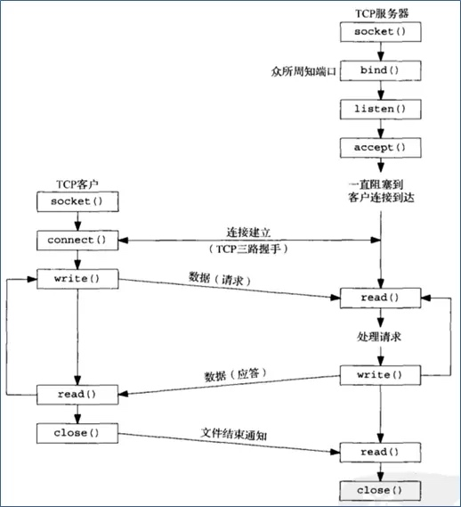

# Socket
1. 任意两个套接字决定一个 TCP 连接
2. Socket 是对 TCP和 UDP 的封装, 使得开发者可以直接使用 TCP 或 UDP. 位于应用层和运输层之间.
3. Socket 是网络通信的基本操作单元
4. 应用开发者无法直接操作运输层, 只能通过 Socket 对运输层进行操作.

## 服务器和客户端启动 Socket

1. Socket()方法执行, 系统生成 Socket Description, 即:套接字描述, 系统为进程需要网络通信分配所需系统资源(CPU, 缓存等)
    1. 创建套接字描述时, 需要指定网络层协议, 如:IP协议, 运输层协议: TCP/UDP

###服务器
1. 执行 bind()时, 绑定本地地址和熟知端口号
2. 执行 listen(), 把套接字变成"被动模式"
3. 执行 accept(), 接受客户的连接请求
    1. 服务器的并发操作: 由于服务器需要支持同时多个 TCP 连接, 在执行 accept 时候, 会多做一些事情: 如下
    2. 一旦执行 accept, 主进程为新的连接请求创建一个新的套接字, 并把新的套接字标识符返回给客户端
    3. 主进程还要创建一个从属进程, 来处理新建立的连接.
    4. 而主进程就用回原来的套接字执行 accept, 继续接受下一个连接请求.
    5. 从属进程通讯结束之后, 会被释放, 新的套接字也会被释放.

###客户端
1. 客户端建立套接字描述之后, 调用 Connect(), 附上远程服务器地址和熟知端口, 发起连接请求.
2. 连接建立完毕, 便使用 tcp 隧道发包.

#CFSocket
1. iOS 是基于 UNIX 系统开发出来的. UNIX 使用 BSDSocket, 所以 iOS 也能支持BSDSocket
2. Core Foundation 对 BSDSocket 实现一套封装, CFSocket, 能实现大部分 BSDSocket 功能
3. 并把 Socket 集成到"运行循环"中
4. 