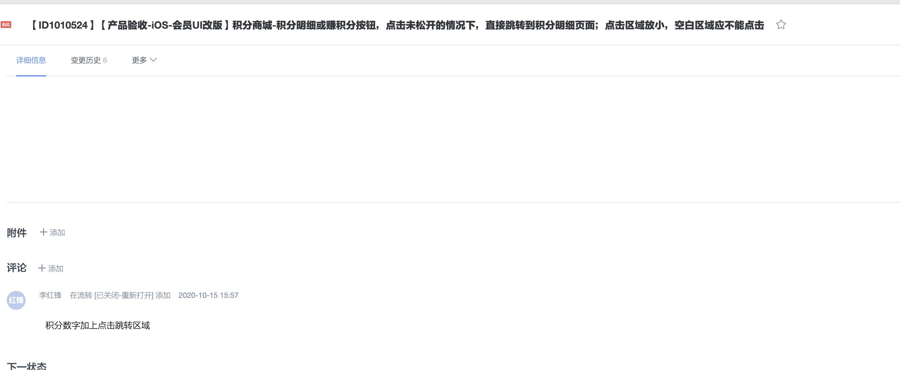

# 开发人员依照什么来开发?

本次UI改版, 都是根据UI图来评审, 研发人员都是依照UI来开发, 那原有逻辑是否变动? 在需求评审时, 多次提到按美团来做, 大厂已经把用户调教好了. 但有时候又说原需求有, 就要有. 这种话一句话把所有需求都定死, 这样很影响开发对需求的理解. 所以会出现很多开发认为应该这么做, 而产品却不收货的情况.

这里列出出现争议的bug比如:
1. 购物袋的输入框, 原逻辑有, 美团没有.
    1. 一开始说好美食不加输入框, 但并没有提到购物袋. 美团的购物袋就不需要输入框
    2. 这个改了半天以上.
2. 金额后两个小数点问题, .00情况下需要不显示.
    1. 这个改了半天以上.
3. 商铺信息: 销量过万. 
4. 美食店铺页, 换行问题.
    1. 我理解: UI设计的初衷, 就认为金额没必要超过3位数或者4位数, 本身就是无需换行的条件下设计出的UI图. 现在设计跟产品需求冲突了, 研发一开始就认为不需要换行, 后面要改成遇到需要换行的情况换行, 导致后面修改需要很复杂.
5. 首页美食推荐, 点击进入哪个页面
    1. 这个原逻辑是进美食详情页. 之前跟问过产品这里跳哪个页面. 产品给出的结论是跳详情. 当时为了弄这个花了大半天时间.
    2. 后期说要跳商铺页.
6. 美食购物袋点击清空时弹框

在此提出几点建议
1. 做一切需求时, 需求文档现行. 然后才开发.
2. 需求评审时, 要评审需求文档和UI设计图.
3. UI设计图应该覆盖全部情况(以下只是举例,并不是说本次需求没覆盖到)
    1. 细节上: 比如商铺信息销售量过万时的UI, 规格未选中时的UI. 规格选择高度是否自适应. 商品售罄与下架的情况.
4. 若发生产品需求和设计师设计冲突
    1. 如果在开发前, 则产品和设计师2人沟通好, 产品修改需求文档, 设计师修改设计图.
    2. 如果在开发阶段, 与TL和开发人员沟通, 好改则好说, 不好改需要重新评审开发时间. 开发前, 产品和设计师应该更新好文档.
    3. 如果提测阶段, 确定了这个不是需求文档里的内容时, 这个不能当做bug给到开发. 开发时间需要另行安排.

这里引出个问题大家讨论
1. 从评审到研发结束期间, 出现某个情况, 评审时开发没有提问, 需求文档也没有涉及到, 但开发按自己想法去实现了. 但是产品讨论结果出来, 开发修改需要花一定量的时间.
    1. 这种情我们应该如何处理?

    
    
    
