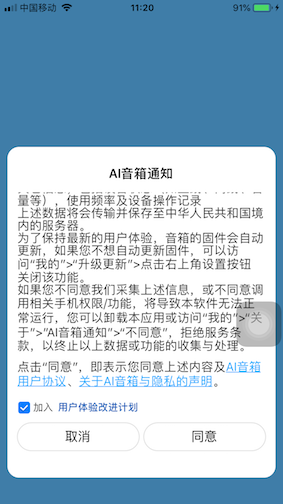
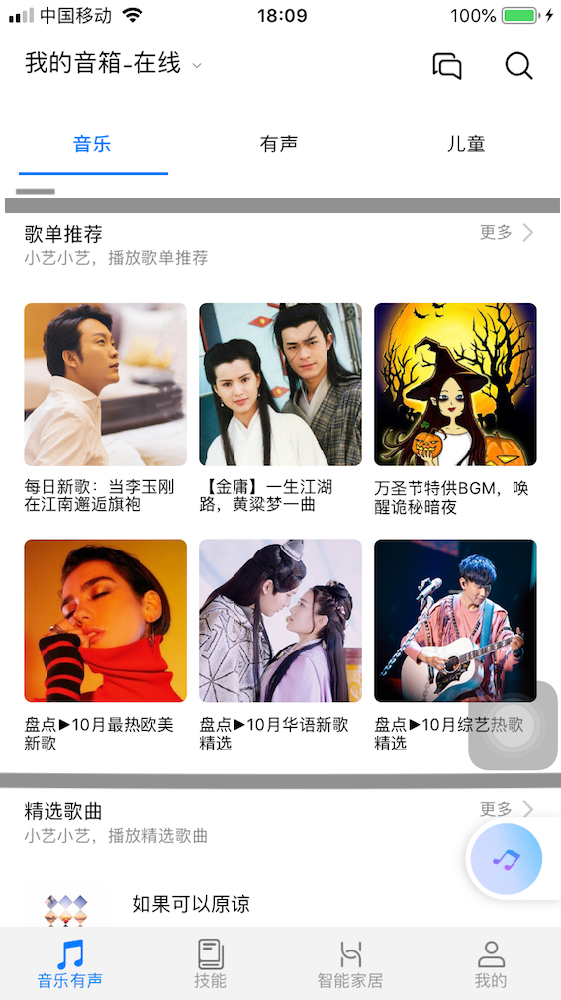
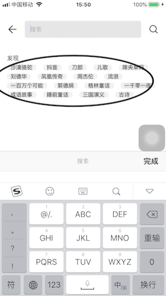
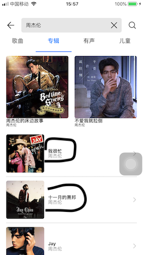
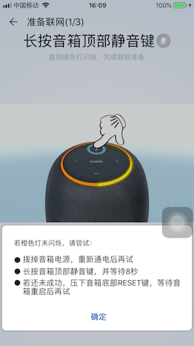
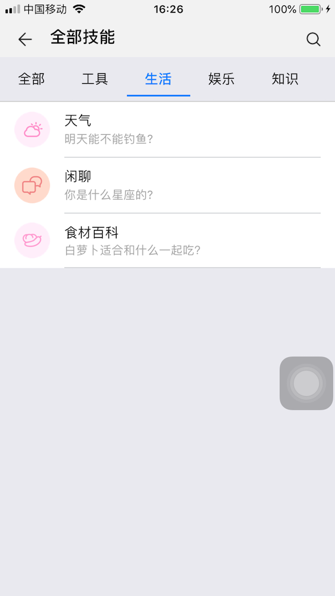
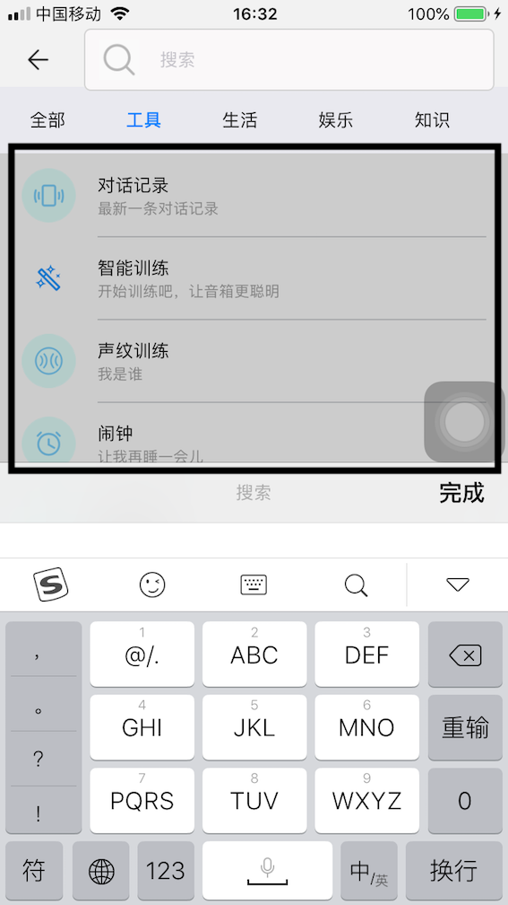
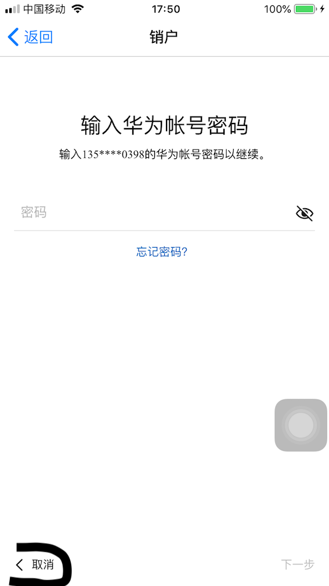

# AI音箱

##用户协议页

1. 页面没有居中
2. "用户体验改进计划"不够明显, 最好能用下划线

## 音乐有声

1. 一个section和一个section之间应该有一个用于间隔的横条比较好, 这样布局比较清晰, 也不会显得空白很多.

### 右上角的搜索页

1. 这页面在弹出来的时候每次都会卡顿, 感觉原因是push页面的时候同时弹键盘的关系, 这里可以优化一下
2. 这个页面的"建议搜索标签"有点丑, 而且按钮有点小, 可以优化一下.

1. 字体可以稍微大一点. 行间距可以高一点
2. 

## 配网准备提示

1. 我觉得这个提示挺好的, 但是没出现在一开始用户第一次使用的页面. 我觉得这个时候更需要

##技能Tab

###技能-更多

1. (在技能tab页面点击更多进入这个页面)这里背景颜色不太和谐, 应该与外面tab页面背景颜色相同

#### 技能-更多-搜索

1. 这个页面点击中间空白, 只是缩了键盘, 应该整个搜索消失

#### 技能-天气-顶部点击深圳

1. 这个页面push出来的时候也是有卡顿, 而且搜索不好用, 搜索不出结果
2. 搜索出来之后, 点击跳转回到上个页面, 但是结果还是没变, 城市没变过来.

## 我的

### 我的页面-个人信息页-设置-销户

1. 取消按钮点击无效

# 个人意见

1. APP应该有一个主题色比较好.一个可以代表APP的颜色. 可以用在一些按钮, 或者一些背景颜色上面.

