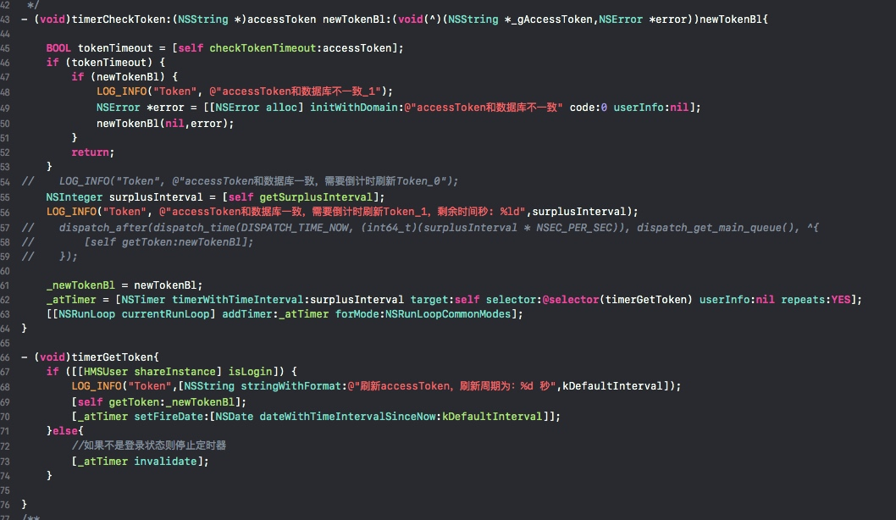

# NSTimer导致的crash

* 创建timer的方法是响应`loginSuccess`通知时调用的
* 但释放的方法确实timer的方法里调用的
* 导致创建多次, 也未必有一次释放.

`[I][2018-12-14 +8.0 14:13:48.430][0, 5329296640][Token][TokenHandle.m, timerCheckToken, 56][Info:accessToken***: 2845`
`[I][2018-12-14 +8.0 15:02:12.883][0, 5369830880][Token][TokenHandle.m, timerCheckToken, 56][Info:accessToken***: -59`
`[I][2018-12-14 +8.0 15:07:59.254][0, 5369540704][Token][TokenHandle.m, timerCheckToken, 56][Info:accessToken***: -405`
* 第一次创建Timer使用interval: 2845
* 第二次创建Timer使用interval: -59
    * 所以马上执行了一次timer, 然后下次执行3000秒(即: 15:52之后)
* 第三次创建timer使用interval: -405
    * 所以又马上执行了一次timer, 然后下次执行3000秒(即: 15:57之后)

所以第二次在执行了一次3000秒之后, 如果得不到释放, 就会按照原来-59的不断的执行下去, 最终导致crash    
