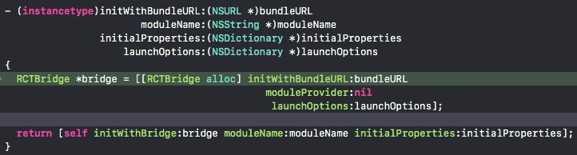
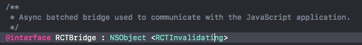
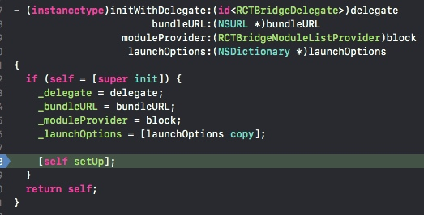
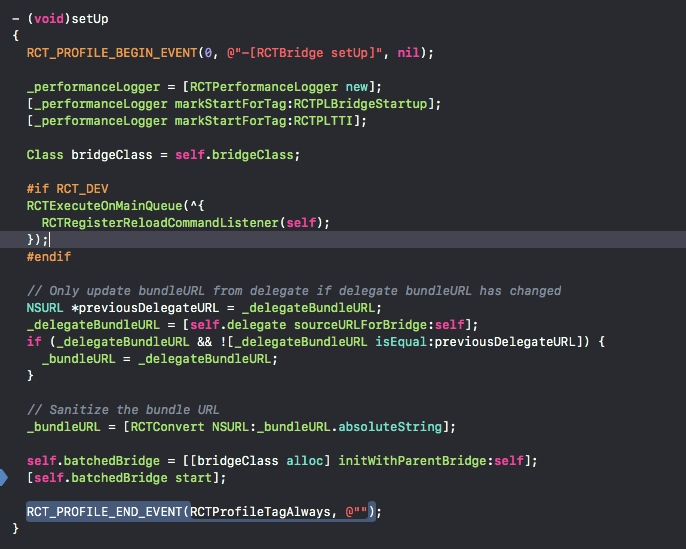
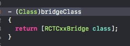
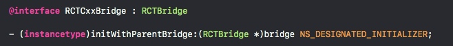
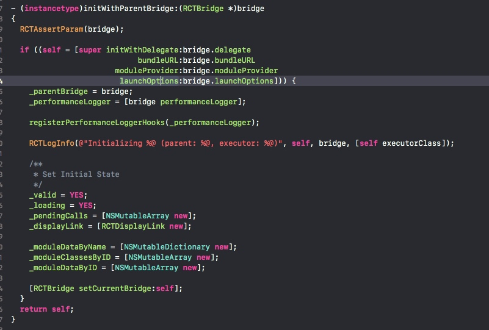
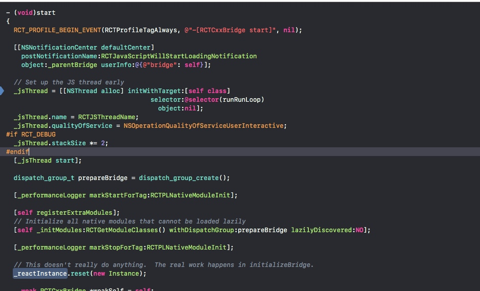

# React_Native启动

> 本着没事干的精神开始写了

本文主要剖析这句代码:
```c
[[RCTRootView alloc]     initWithBundleURL: jsCodeLocation
                                moduleName: @"index"
                         initialProperties: props
                             launchOptions: nil];
```
清楚这个代码做了什么, 基本上RN原理就清楚了

## 创建RCTBridge

```
RCTBridge *bridge = [[RCTBridge alloc] initWithBundleURL:bundleURL
                                            moduleProvider:nil
                                             launchOptions:launchOptions];
```
第一步创建RCTBridge


* 因为RCTBridge继承NSObject, 只是多了一个协议而已(=.=幸好, 不是很复杂), 所以就当他new一个对象, 把相关入参赋值给自己成员变量.
* 之后执行`[self setup]`方法
* 
    * 一开始就只是初始化Logger, 这个Logger这种东西砸门不关心, 直接瞄到最后
        * `  self.batchedBridge = [[bridgeClass alloc] initWithParentBridge:self];`
        * `  [self.batchedBridge start];`
    * 变量`bridgeClass`其实就是RCTBridge的一个get方法拿到的, return都是写死的.
    * 接着做一个new一个RCTCxxBridge对象的操作, 
        * 
        * RCTCxxBridge继承RCTBridge
    * 
    * 那RCTxxBridge的初始化,调用的是父类的, <font color='red'>自己的setup方法置空</font>
    * 赋值好各个成员变量之后, 把自己赋值给RCTBridge的currentBridge, 这是一个在类里的静态变量
* 
* 以上是RCTCxxBridge的start方法
    * 创建了JSThread, 并执行RunLoop方法, 使之不释放
* `[self _initModules:RCTGetModuleClasses() withDispatchGroup:prepareBridge lazilyDiscovered:NO];`
* 这句是重点, 这里收集到所有通过`RCT_EXPORT_MODULE()`方法暴露出去的类, 
* 这里遍历每一个Class, 为每个Class创建`RCTModuleData`的对象, 并加到`_moduleDataByName`这个成员变量中(属RCTCxxBridge)


