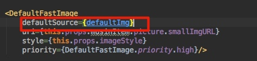

#首页图片缓存解决方案
> 本次图片主要指music-main的banner, 歌单推荐(Recommend-4), 精选歌曲(Song-1), 精选专辑(ALBUM-2) 

主要方案: native获取音乐数据, 转给RNRootView, 在app.js的时候通过props获取这些数据, 赋值给global.musicData字段, music-main通过这个字段进行判断.
## 歌单推荐(MusicSquareItem)
* 首次APP启动
    * 验证global.mainData是否为空
        * 在native拿到Recommend的数据, 在`app.js`通过props拿到, 经过逻辑处理, 转化成所需JSON的对象, 赋值给global.RecommendData (改造点)
        * 到了`music-main.js`, 在constructor里, 把DBRecommend赋值`global.RecommendData || {}`
        * 判断这个DBRecommend是否为空即可.
    * 验证global.mainData为空, 使用defaultImg加载
        * `music.json`改为`music.js`, 里面的picture字段使用require, 这个文件统一配置"最初的数据". (改造点)
        * `MusicSquareItem`直接加载`music.js`数据.
            * 整个data传给FlagList, 通过dataItem来创建一个个AlbumItem(改造点)
                * 这里`AlbumItem`的defaultImg不在从本地获取, 直接从数据源获取
                    * 
                    * 与这相关的都去掉.
                * 接着DefaultFastImage里也要修改, 如下: (改造点)
                    * 首先iOS和安卓都直接使用FastImage
                    * uri判断, 如果是Number则直接使用, 如果是string, 则`{uri: uri}`.
                    * loading的逻辑去掉.
    * 如果验证global.mainData不是空
        * 直接拿global.mainData渲染组件`MusicSquareItem`
        * 数据里含上次的url, url传给AlbumItem里的DefaultFastImage再传给FastImage, 他拿到这个url, 可通过自身的缓存机制, 拿到沙盒的图片, 前提是url必须一模一样(PS: 这里要测一下每次传过来的图片url是否一样, 后缀的数字可能会变!).

## banner的图片缓存
* JS里未做缓存banner的机制, 但有默认的图片. 所以还是会造成闪一下的情况.
* 所以需要对网络数据做一下缓存
    * 使用`DBConfig.set("Key_MainBanner", bannerInfo)`
    * 下次启动的时候, 简单的判断一下数据吧. 然后在app.js里传给global.mainBannerData
    * 在music-main.js里传给state.DBBanner
    * 完成

    
## 推荐歌单
* 使用默认的图片, 换成music.js里的资源
* 