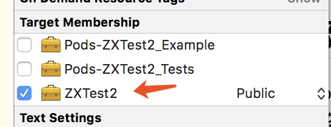
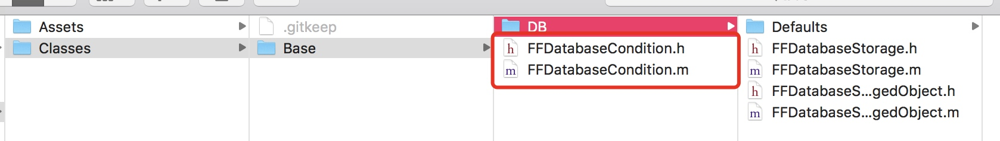
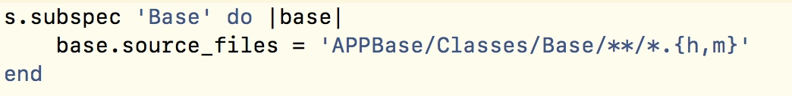
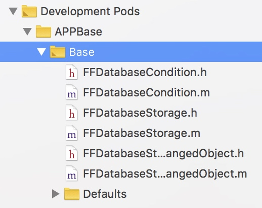
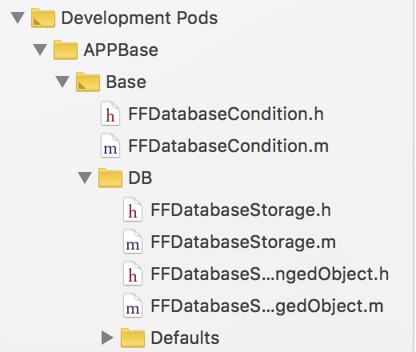

# Pod库的创建
1. 在安装好CocoaPod环境下使用`pod lib create PodName`来创建私有库
2. 在终端上回答5个问题, ios, objc, yes, none, no
3. 在pod里创建文件时, target需要是podName, 而不是Pod-podName-Example, 文件属性要public
    1. 
    2. public就整个workspace都能访问, project的话只能pod.project里访问
    3. 选择哪个target, 标识编译连接的时候会打入程序包里面.
4. 创建好之后, 需要重新pod install一下, 即可在原project上调用
5. 以上就是一次完成的从0到创建class, 使用class. 如果有发现调用不了, 或者调用没反应, 就去删除deviceData, cmd + shift + k, 再rebuild一下.

#如何让pod install的时候自动根据文件夹读取

让最外部的文件夹的目录上有文件!

假如你是这么写的.
如果红色框框里没有文件. 则

如果红色框框有文件, 则

