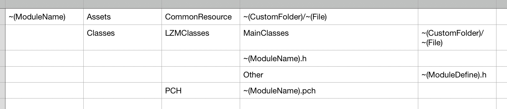

# 储能App端ios模块化
现存在问题:
  所有项目都在同一个仓库同一个工程目录底下, 通过ios项目的多target机制, 实现一个工程多个项目的情况. 而且所有功能模块都在这个仓库下实现. 导致在多个项目都有定制的情况下, 代码难以维护.
  如: 
  1. 储能在主分支, 光启, 泰然, 云里汇, 大百汇都在子分支
  2. 光启的商城, 个人中心, UGC和储能是一样, 但停车缴费不一样, 所以光启单独一个分支
  3. 泰然的商城, 个人中心, UGC都是旧版的, 单独一个分支
  4. 云里汇4个tab不一样, 个人中心也不一样, 单独一个认知
  5. 大百汇(最少维护的一个项目). 在最老的分支.

其次ios的app项目较大, 其中一些无用的图片资源占了一定的部分. 原因是: 在开发新版的模块的时候, 旧版的图片没有做移除操作, 导致旧版的图片还在工程里, 而新版又增加了图片. 

综上所述:
想通过本次计划模块化来解决上述问题.

闪电玩, 泰然全部服务(资讯)
##新建仓库: 
###一. 基础模块(Base):
网络框架, 
###二. 用户模块(User): 
用户模型, 登录注册. 
###三. 首页模块(Home):(首页, 公告
首页UI组件, 
###四. 门禁模块(entrance):(门禁)
目前只有泰然用了比较新的方法. 储能和云里汇用的是旧的方法. 两个差异不大. 可以先实现储能云里的, 之后改成泰然的.
###五. 物业服务(property):
公共报修, 室内报修, 资讯求助, 建议投诉, 物品租借, 物品放行
###六. 停车缴费(parking):(月卡, 缴费, 开票)
储能用的是旧版, 云里, 光启用的是新版. 两个差异较大. 建议两个分支实现
###七. 快递(express):
寄快递, 寄件追踪
###八. 商城模块(ec):美食, 优品, 购物车, 订单
泰然用的是旧版, 而储能光启用的是新版, 在新建仓库的时候, 考虑到两个版本差异较大, 所以干脆用两个分支来维护. 除了代码的, 其他的资源(图片, json)和业务相关的都放在模块里面.
我的卡券
###我的
我的页面, 设置, 我的信息, 公司认证, 身份认证, 意见反馈, 通讯录, 访客邀请, 消息中心, 
###九. 会员(member):
会员中心, 会员权益, 积分商城, 赚积分
###十. UGC:
泰然用的是旧的资讯, 储能光启都是用新的UGC, 建议分两个分支实现
我的活动, 话题, 广场, 头条
###十一. web(H5相关组件):
###十二. wifi模块(wifi):
###十三. 启动模块
包含tabbar的逻辑, tab动画, 动态tab, 为日后打入楼管项目做准备(是启动楼管还是启动运营app)
###十四. 人脸(face):

##模块规范:
文件目录

Asset: 所有资源文件都应该放在这个目录里.
Classes: 放置所有代码文件

~(CustomFolder): 根据业务命名的文件夹
~(File): 根据业务命名的文件
~(ModuleName).pch: 放置一个模块范围的pch文件
~(ModuleName).h: 放置一个模块对外暴露的接口文件
~(ModuleDefine).h: 放置一个模块范围的.h文件, 定义业务接口等等.
  
  
#遗留问题:
  1. jumpType跟着模块走.(实现移除模块的时候, 不需要修改代码)