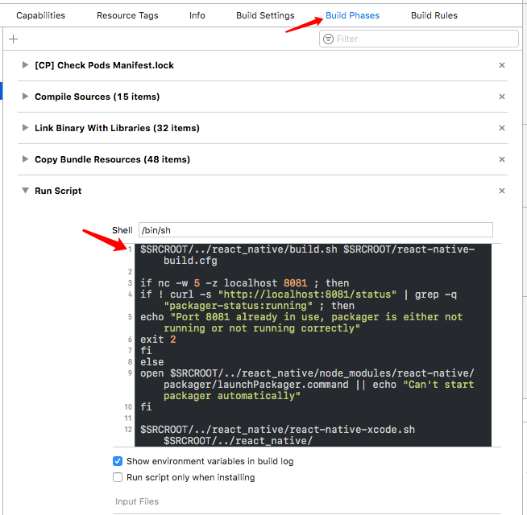

#React-Native
##React-Native 的启动时的所需脚本
* node_modules/react-native/local-cli/cli.js
    * 这个需要用 node 来执行`node node_modules/react-native/local-cli/cli.js start`
    * npm start 就是执行以上这句话, 这个脚本会启动 terminal 来打开8081端口.
    * 若执行 node cli.js bundle 则是打 jsbundle 包, 详情见 F 项目最后, 可查所需入参

    ---
##F 项目启动过程
1. 当运行 FFProject 的时候, Xcode 会Run Script, 是由于配置了这里

2. 脚本代码如下并加上注释

```
//$SRCROOT 是指 Xcode 目录, 以下这句好像没什么用, 因为没有那个 cfg 文件
$SRCROOT/../react_native/build.sh $SRCROOT/react-native-build.cfg

if nc -w 5 -z localhost 8081 ; then
if ! curl -s "http://localhost:8081/status" | grep -q "packager-status:running" ; then
echo "Port 8081 already in use, packager is either not running or not running correctly"
exit 2
fi
else    //至此以上代码好像是检测8081是否被占用, 并提示用户
open $SRCROOT/../react_native/node_modules/react-native/packager/launchPackager.command || echo "Can't start packager automatically"
fi
//至此, launchPackager.command 里就调用同目录下的 packager.sh, 而 packager.sh 调用了 local-cli/cli.js. 这里就相当于手动执行了npm start


/*
下面这代码相当于执行了./Packager/react-native-xcode.sh, 里面对入参做的一系列判断和操作, 都是为了执行这一句代码
`npm run package -- --platform ios --bundle-output "$DEST/main.jsbundle" --assets-dest "$DEST" --dev $DEV`
这句代码之前先 cd 到./react_native 目录下, npm run xxxx, 是要执行当前目录下 package.json 里 script 字段里的 xxxx 命令, 也就是python packager/package.py
package.py 里面也是做了一系列判断和操作, 最后执行了这句话
node --max-old-space-size=4096 node_modules/react-native/local-cli/cli.js bundle --platform %s --dev true --entry-file index.js --bundle-output %s --assets-dest %s --sourcemap-output %s" % (platform, bundle_path, imgs, sourcemap_path)], shell=True)
又执行了 cli.js, 不过这次是 bundle, 说明这个脚本也可以用来打 jsBundle
*/
$SRCROOT/../react_native/react-native-xcode.sh $SRCROOT/../react_native/
```

###附录:
LaunchPackager.command:

```
#!/usr/bin/env bash
  
# Copyright (c) 2015-present, Facebook, Inc.
# All rights reserved.
#
# This source code is licensed under the BSD-style license found in the
# LICENSE file in the root directory of this source tree. An additional grant
# of patent rights can be found in the PATENTS file in the same directory.

# Set terminal title
echo -en "\033]0;React Packager\a"
clear

THIS_DIR=$(dirname "$0")
pushd "$THIS_DIR"
source ./packager.sh
popd

echo "Process terminated. Press <enter> to close the window"
read
```

Packger.sh

```
#!/usr/bin/env bash
  
# Copyright (c) 2015-present, Facebook, Inc.
# All rights reserved.
#
# This source code is licensed under the BSD-style license found in the
# LICENSE file in the root directory of this source tree. An additional grant
# of patent rights can be found in the PATENTS file in the same directory.

THIS_DIR=$(dirname "$0")
node "$THIS_DIR/../local-cli/cli.js" start "$@"
```

./react_native/react-native-xcode.sh

```
#!/bin/bash
# Copyright (c) 2015-present, Facebook, Inc.
# All rights reserved.
#
# This source code is licensed under the BSD-style license found in the
# LICENSE file in the root directory of this source tree. An additional grant
# of patent rights can be found in the PATENTS file in the same directory.

# Bundle React Native app's code and image assets.
# This script is supposed to be invoked as part of Xcode build process
# and relies on envoronment variables (including PWD) set by Xcode

cd $1 #$SRCROOT/../../../../react_native/
sh ./packager/react-native-xcode.sh $1
```

./react_native/packager/react-native-xcode.sh

```
# This source code is licensed under the BSD-style license found in the
# LICENSE file in the root directory of this source tree. An additional grant
# of patent rights can be found in the PATENTS file in the same directory.

# Bundle React Native app's code and image assets.
# This script is supposed to be invoked as part of Xcode build process
# and relies on envoronment variables (including PWD) set by Xcode

case "$CONFIGURATION" in
  Debug)
    DEV=true
    ;;
  Release)
    DEV=false
    ;;
  "")
    echo "$0 must be invoked by Xcode"
    exit 1
    ;;
  *)
    echo "Unsupported value of \$CONFIGURATION=$CONFIGURATION"
    exit 1
    ;;
esac

# Xcode project file for React Native apps is located in ios/ subfolder

set -x
DEST=$CONFIGURATION_BUILD_DIR/$UNLOCALIZED_RESOURCES_FOLDER_PATH

# Define NVM_DIR and source the nvm.sh setup script
[ -z "$NVM_DIR" ] && export NVM_DIR="$HOME/.nvm"

if [[ -s "$HOME/.nvm/nvm.sh" ]]; then
  . "$HOME/.nvm/nvm.sh"
elif [[ -x "$(command -v brew)" && -s "$(brew --prefix nvm)/nvm.sh" ]]; then
  . "$(brew --prefix nvm)/nvm.sh"
fi

cd $1 #$SRCROOT/../../../../react_native/

npm run package -- --platform ios --bundle-output "$DEST/main.jsbundle" --assets-dest "$DEST" --dev $DEV

if [ $? -ne 0 ];then

echo 'RN bundle 失败!'

exit 1
fi


```

./react_native/package.json

```
{
  "name": "react_native_git",
  "version": "0.0.1",
  "private": true,
  "scripts": {
    "start": "./moduleparser && node node_modules/react-native/local-cli/cli.js start",
    "reverse": "adb reverse tcp:8081 tcp:8081",
    "android": "npm run reverse; npm start",
    "build_ios": "echo ios",
    "build_android": "./moduleparser && node --max-old-space-size=4096 node_modules/react-native/local-cli/cli.js bundle --entry-file index.js --platform android --dev false --bundle-output ../app/src/main/assets/index.android.bundle --assets-dest ../app/src/main/res/ --sourcemap-output /tmp/sourcemap.txt",
    "eslint": "eslint --rulesdir ./HFCommon/hfLintRules",
    "esl": "eslint --rulesdir ./HFCommon/hfLintRules --quiet",
    "eslint-fix": "eslint --rulesdir ./HFCommon/hfLintRules --fix -c .eslintrc-fix.yaml",
    "test": "./moduleparser && node node_modules/react-native/local-cli/cli.js bundle --entry-file index.js --platform ios --dev true --bundle-output /dev/null",
    "package": "python packager/package.py"
  },
  "dependencies": {
    "babel-eslint": "^6.1.2",
    "co": "^4.6.0",
    "eslint": "^3.1.1",
    "eslint-plugin-react": "^5.2.2",
    "i18n": "^0.8.3",
    "react": "^15.2.1",
    "react-native": "^0.29.0",
    "react-native-collapsible": "^0.5.5",
    "react-native-communications": "^0.2.3",
    "react-native-swiper": "^1.5.1",
    "react-native-viewpager": "^0.2.1",
    "react-redux": "^4.4.5",
    "react-timer-mixin": "^0.13.3",
    "reduce-reducers": "^0.1.2",
    "redux": "^3.5.2",
    "redux-actions": "^0.10.1",
    "redux-logger": "^2.6.1",
    "redux-thunk": "^2.1.0",
    "reflux": "^0.4.1",
    "reselect": "^2.5.3",
    "sprintf-js": "^1.0.3",
    "tinycolor2": "^1.4.1"
  }
}
~               
```


./react_native/packager/package.py

```
#!/usr/bin/python
# -*- coding: utf-8 -*-
# author: panweizhou500

import os,sys,subprocess,time,shutil,getopt

reload(sys)
sys.setdefaultencoding('utf8')

def paramError():
    print ('''参数错误：

    $ python packager.py --platform <平台> --bundle-output <bundle文件工程路径> --assets-path <图片资源文件夹工程路径> --dev <是否打调试包> 

    ''')

def flatDrawableDir(dir_path, precise):
    ''' 扁平化整个目录 '''
    if os.path.exists(dir_path) and os.path.isdir(dir_path):
        file_list = os.listdir(dir_path)
        for file in file_list:
            basename = os.path.basename(file)
            basename, extname = os.path.splitext(basename)
            subprocess.call(["mv", file, os.path.join("..", basename+"@"+precise+extname)], cwd=dir_path)
        subprocess.call(["rm", "-r", dir_path], cwd=os.path.join(dir_path, ".."))

def main():
    platform = ''
    project_bundle_path = ''
    project_assets_path = ''
    isDev = False
    dev = ''
    try:
        opts, args = getopt.getopt(sys.argv[1:], "p:bad:", ["platform=", "bundle-output=", "assets-dest=", "dev="])
        for arg, value in opts:
            if arg in ('-b', '--bundle-output'):
                project_bundle_path = value
            elif arg in ('-a', '--assets-dest'):
                project_assets_path = value
            elif arg in ('-d', '--dev'):
                dev = value
            elif arg in ('-p', '--platform'):
                platform = value
            else:
                print "Argument error. %s" % arg
                exit(1)
    except getopt.GetoptError as e:
        paramError()
        exit(1)    
    if dev.lower() == 'true':
        isDev = True
    timestamp = time.time()
    root = os.path.join(os.getcwd())
    dest = os.path.join(os.getcwd(), "bundles/%s_%s" % (platform, timestamp))
    imgs = os.path.join(dest, "imgs")
    bundle_path = os.path.join(dest, 'index.%s.bundle' % platform)
    sourcemap_path = os.path.join(dest, 'sourcemap.txt')
    if not os.path.exists(dest):
        os.makedirs(dest)

    print("正在打包bundle...")
    if isDev:
        pipe = subprocess.Popen(["./build.sh && node --max-old-space-size=4096 node_modules/react-native/local-cli/cli.js bundle --platform %s --dev true --entry-file index.js --bundle-output %s --assets-dest %s --sourcemap-output %s" % (platform, bundle_path, imgs, sourcemap_path)], shell=True)
    else:
        pipe = subprocess.Popen(["./build.sh && node --max-old-space-size=4096 node_modules/react-native/local-cli/cli.js bundle --platform %s --dev false --entry-file index.js --bundle-output %s --assets-dest %s --sourcemap-output %s" % (platform, bundle_path, imgs, sourcemap_path)], shell=True)
    res = pipe.wait()

    if project_assets_path != '':        
        if os.path.exists(imgs):
            if not os.path.exists(project_assets_path) or not os.path.isdir(project_assets_path):
                print ("错误：工程 assets 路径 %s 不存在" % (project_assets_path))
                exit(1)
            # 将图片资源目录拷贝到工程图片资源目录
            res = subprocess.call(["for i in `ls %s`; do cp -a %s/$i %s/; done" % (imgs, imgs, project_assets_path)], cwd=root, shell=True)
            if res == 0:
                print ("将资源文件拷贝进工程资源目录成功")
            else:
                print ("错误：拷贝图片资源进工程失败！")
                exit (1)
        else:
            print ("错误：拷贝图片资源进工程失败！")
            exit (1)


    
    if project_bundle_path != '':
        if os.path.exists(bundle_path):
            # 将bundle文件拷贝到图片资源目录
            try:
                shutil.copyfile(bundle_path, project_bundle_path)
                print ("拷贝bundle文件进工程成功")
            except Exception:
                print ("错误：拷贝bundle文件进工程失败！")
                exit (1)
        else:
            print ("错误：拷贝bundle文件进工程失败！")
            exit (1)
            
        
    if os.path.exists(bundle_path):
        if platform == "android" and os.path.exists(imgs):
            print("打包成功！正在扁平化Android资源目录...")
            os.chdir(imgs)
            flatDrawableDir(os.path.join(imgs, "drawable-mdpi"), "1x");
            flatDrawableDir(os.path.join(imgs, "drawable-hdpi"), "1.5x");
            flatDrawableDir(os.path.join(imgs, "drawable-xhdpi"), "2x");
            flatDrawableDir(os.path.join(imgs, "drawable-xxhdpi"), "3x");
            flatDrawableDir(os.path.join(imgs, "drawable-xxxhdpi"), "4x");
            print("扁平化完成")        
        os.chdir(dest)
        junk_file = "imgs/.DS_Store"
        if os.path.exists(junk_file):
            print("正在删除垃圾文件...")
            os.remove(junk_file)
            print("删除完成")
        print("正在压缩成zip包...")
        res = subprocess.call(["zip -r %s.zip imgs index.%s.bundle " % (timestamp, platform)], shell=True, cwd=dest)
        if res == 0:
            print("完成！成功打包至：%s\n" % (dest))
            exit (0)
        else:
            print("压缩失败！")
            exit (1)
    else:
        print("打包失败！")
        exit (1)

if __name__ == "__main__":
    main()

```

