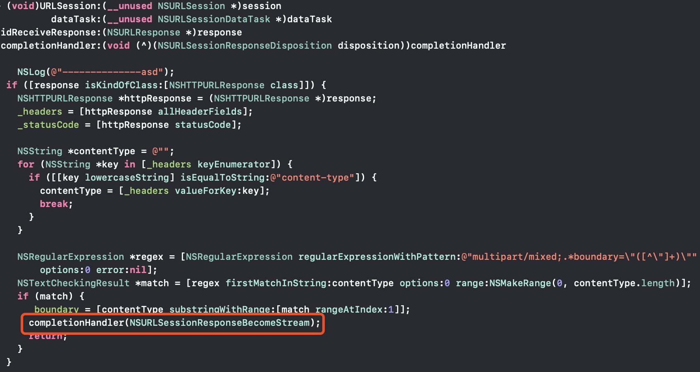
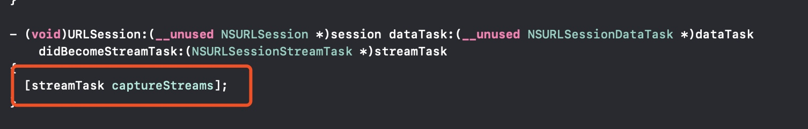
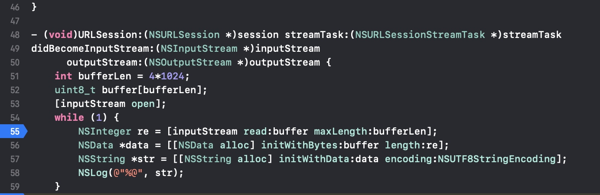

# iOS_RN通过WiFi加载bundle
其实就是一次访问局域网资源的请求, 地址为: http://localhost:8081/index.bundle?platform=ios&dev=true&minify=false

使用NSURLSession加载这个地址, 在请求头添加一个键值对: Accept: multipart/mixed
* 这个键值对的意思是: 设置Content-Type为multipart, 具体内容请参考HTTP协议: [multipart](https://www.w3.org/Protocols/rfc1341/7_2_Multipart.html)
* 大概意思是: 分多个部分返回内容给你, 通过某个标识分界, 这个标识在ResponseHeader里Content-Type里获取boundary

在delegate回调里, 拿到HTTPResponse, 从header里拿到boundary
然后执行completeHandler(NSURLSessionResponseBecomeStream), 使从dataTask变成streamTask, 然后执行streamTaskDelegate方法

以下是关键方法: 

执行completeHandler的之后, 会执行以下delegate方法, 此时要执行关键方法, 之后才会执行streamDelegate方法

