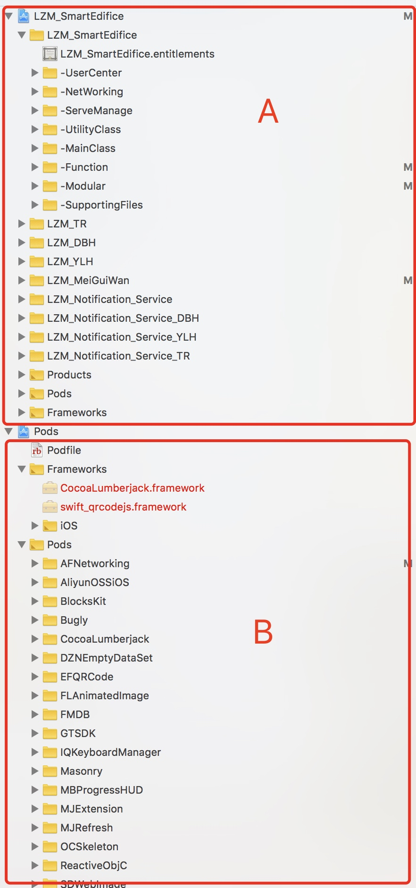
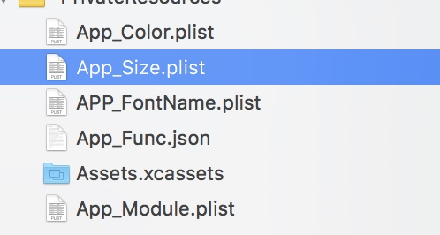
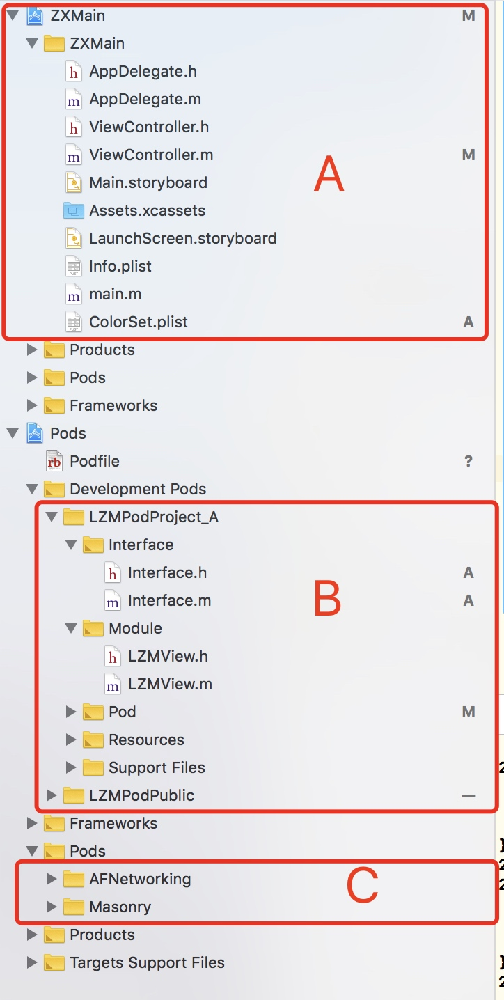

# 使用CocoaPod模块化
###原项目结构

1. A区是项目工程, 里面文件大部分都是多target公用, 只有小部分是针对某个target使用
    1. 优点:
        1. 项目结构简洁, 易于新人入手.
    2. 缺点:
        1. 随公司业务增大, target变多的时候, 客户需求会多种多样, 不易于根据客户定制需求开发.
        2. target变多的时候, 同名的文件(配置文件)会越来越多, 比较难多人维护.
        3. 有些功能模块不需要给某个客户, 虽然
2. B区就是项目用到的第三方库

###模块化优缺点: 
####优点
1. 可以针对不同的客户, 灵活的导入客户所需业务. 
2. 代码结构清晰明了
3. 业务模块与主工程分开, 减轻主工程代码量, 易于日后针对某个业务模块进行维护升级.

####缺点
1. 每次给业务模块新增文件, 都需要执行`pod install`命令, 导入工程, 否则主工程引用不了. 降低开发效率.
2. 需要整理出一个基础模块库(Base), 该库除了"原生系统库"和"第三方库"以外, 没有任何依赖, 模块化的第一步骤就是抽出此库. 之后才好抽业务库.
    * 因为只能A区引用B去, B区内部可以互相引用, 但B区不能引用A区.
    
###所需要做的事情:
1. 整理公共模块库(Base).
2. 整理业务库, 以XX为一个模块, 该模块的依赖.
3. 配置项 | 资源文件
    1. 
    2. 图片(是否跟着业务模块走)
        1. 目前所有target都有一个自己的Asset, 而且多数都是重复的. 虽然不会影响每个target打出的包, 但会影响工程仓库的重量.
        2. 业务库必不可免的引用图片资源, 但在Pod库里, 如果要存放自己业务所需的图片, 只能存在在某个文件夹里, 以`ContentOfFile`方法使用, 该方法不影响1X,2X,3X的选取机制, 当然也能像以前一样正常引用主工程里Asset, 只是图片和业务代码分开了.
            1. 建议: 把业务模块所需图片跟着业务走. 公共图片跟着基础模块走. 如需要定制, 把定制图片以同名的方式存放到主工程的Assset.
    3. 颜色 | 字体(是否跟着业务模块走)
        1. 目前颜色和字体都是C1~C10, T1~T10, 这样的形势出现. 我所理解的模块化, 是每个模块都有自己的配置文件, 里面清晰的表明哪个地方使用着什么颜色. 比如首页模块里的配置文件写着`{"Home_BgColor": "C1", "Home_ItemFont": "T1"}`, 这样一目了然知道该模块有什么配置项, 然后修改即可.
        2. 如果保持目前状况, 可以在基础模块存放字体 | 颜色等配置文件, 如果需要定制, 则在主工程也存放个同名的文件, 修改对应的key值即可.

###完后的项目的结果:
1. 项目代码结构(DEMO)如下

这是使用CocoaPod模块化后的工程目录
1. A区为主工程
    1. 可以针对客户需求进行配置, 或者定制化开发
    2. 这里可以继续保留多Target的机制(不同target, 不同的配置文件)
2. B区为本地的业务库(LZMPodProject_A | LZMPodPublic)
    1. 根据我们公司自己的需求, 进行更新迭代
    2. 我们可以统一库的格式, 打开某个库, 只有Interface和module两个文件夹, 这样让新人也能一目了然, 主工程也只是引用Interface就可以了.
    3. Resource文件夹只存放当前库所需要的资源文件, 比如: JSON, plist, png, jpeg, css, html等等文件.
        1. 每个业务库都要自己的bundle, 所以不同的库也能有相同的文件名. 跑起来的之后, 业务库的bundle会以模块名为名, 存在MainBundle里.
    4. 不同的业务库能互相引用. 但B区不能引用A区.
    5. Support Files文件夹存放着一个pch文件, 创建模块的时候, pod自动生成, 只要当前模块才有效
3. C区则是外部的第三方库, 基本上不会动
    1. 同一个第三方库, 只能有一个版本存在于工程里.不能引用2个不同版本
    2. 如果业务库引用了第三方库, pod会自动加载. 加载后, 主工程也能使用
    3. 业务库如果需要第三方库, 一定要在自己的podSpec里声明, 否则即使已经存在, 也引用不了.

    
###日后维护:
1. 目前工程是多个target一个仓库, 可以把target拉成分支. 多target的话, 主工程就会有多套同名的配置项或者类文件. 拉分支的话, 主工程就只有一套配置项和类文件.
2. 如果去target机制, 导致主工程因多个客户有多分支的话, 那每个模块也要另起一个仓库, 单独维护. Pod的模块化是支持我们这么做的. 他给每个模块都新建一个工程, 单独调试这个模块. 
3. 如果每个模块都有单独仓库, 那日后客户如有大的定制需求, 那可以在这个模块另起分支. 在原有的模块基础上, 单独给这个客户定制他所需的模块.
4. 综上所述:
    1. 如果不单独建仓库, 和在原工程上新建文件夹重新整理代码结构没什么区别. 如果模块解耦的好的话, 就方便导入和移除业务代码.
