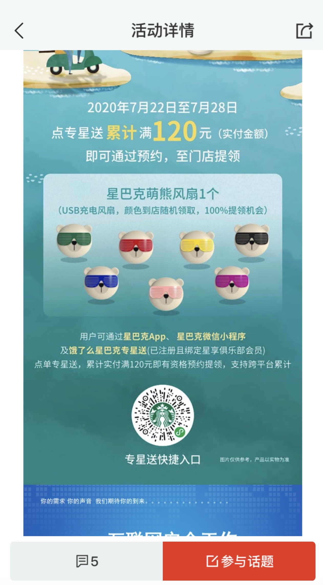

# 审核被拒原因
储能
1. 用户生成内容
    1. 需要用户协议, 要求不得生成不和谐内容
    2. 需要举报机制
    3. 需要屏蔽, 拉黑机制
    4. 开发者需要24小时内处理这些举报(移除内容, 处理内容发布者)
2. 提供一个完整功能的账号(DemoAccount)

泰然
1. 用户生成内容
    1. 需要用户协议, 要求不得生成不和谐内容
    2. 需要举报机制
    3. 需要屏蔽, 拉黑机制
    4. 开发者需要24小时内处理这些举报(移除内容, 处理内容发布者)
2. 提供一个完整功能的账号(DemoAccount)
3. 被认为有赌博和竞赛内容
    1. 需要升级评级, age: 17+
    2. 需要注明这些内容与苹果公司无关
    3. 

