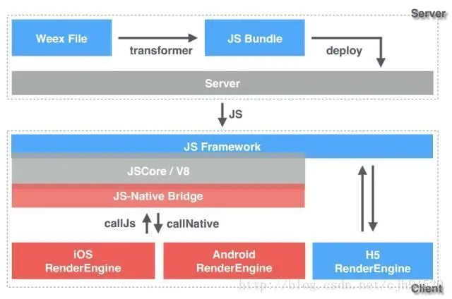
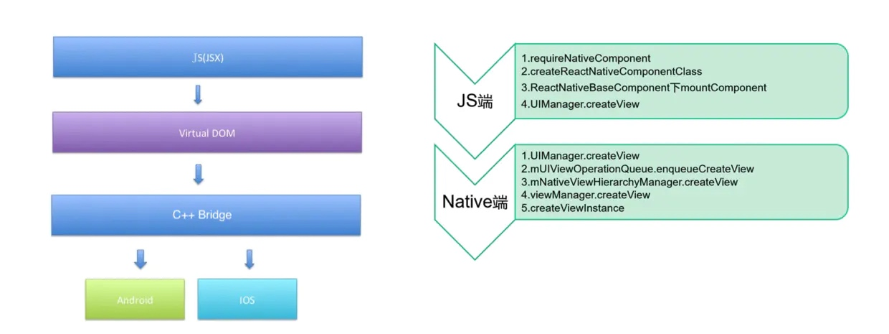

# 储能App实现小程序平台

##客户端现状
1. 纯原生, 迭代慢, 小改小变都需要发版.
2. 项目多, 定制多, 日后维护和迭代需要快速, 解决线上问题能迅速.

就以上情况, 提出问题: 
能否通过前端编写代码, 部署到后台, 下发给客户端, 快速进行迭代和修复问题.

##可实施方案
1. uni-app平台的接入
2. React-Native平台接入

#uni-app

##介绍
  uni-app是一款可以跨多端的前端框架, 开发语言: Vue.js, 他可以发布到iOS, Android, H5以及各种小程序(微信, 支付宝, 百度, 淘宝等等).
  uni-app是双渲染引擎可选(WebView\weex), 因为他的前身是5+App(是WebView渲染), 使用的vue.js. 引入了weex后, 改进后则成了uni-app. 使用的是nvue (native vue)
  weex是由Alibaba出品, JS V8引擎, 使用Vue语言开发, 使用原生渲染
  一个是用WebView渲染, 一个是用原生渲染, 其性能和用户体验感都是不言而知的是后者优秀. 

##实现原理
这边讲讲weex的一些原理吧, weex主要由三个模块组成: JSBridge, Render, Dom, 其中JSBridge和Dom在一个子线程运行, 而Render则在UI线程.
JSBridge是用来与JS端通讯的, 比如JS端的dom结构通过JSBridge传递给Dom模块, 由他来解析, 然后通知UI线程渲染, 而Render就负责对dom进行渲染.

与平常的vue开发不一样, 通过JS生成的dom是一个virtualDOM(个人理解为: UI的描述), 通过JSFramework来决定是否是直接生成真实的DOM还是交给原生渲染引擎渲染.
这就是weex为什么能跨平台的原因, 写一套代码, 可在iOS,Android,Web平台上运行.

uni-app在weex的基础上做了许多优化和改进, 并且还在频繁的频繁的迭代. 看他迭代记录基本上至少是一个月一更新.

##优缺点
weex的优缺点: 比较容易上手, 轻量级框架, 适合单页面开发.

>这里解释一下为什么说适合单页面开发: 一个weex的页面需要一个原生载体来承载(ios:Controller, Android:Activity), 如果使用weex的vue-router来进行页面跳转, 那还是在原来的那个载体, 当用户返回上一个页面的时候, 会有的空白期, 给用户体验效果不太好. 这里可以通过每次跳转的时候使用原生的载体跳转, 不过这样会增加通讯成本. 而恰恰uni-app也吧这个问题修复了!

SDK支持的API较少, 往往需要原生开发的支持, 但在uni-app的扩展上, 已经陆续更新了很多与原生相关的api, 比如直播等高级api.

##uni-app的bundle
JSCore是打包在uni-app的SDK里的, 而业务代码是单独分离出来的, vue.js代码经编译器编译后,生成的wgt文件即包含我们的业务代码, 由uni-app的SDK进行解析和处理. 热更新其实就是变更这个包, 至于是全量更新还是差量更新则看框架如何处理了.

##个人看法
站在iOS端的角度上, 如果uni-app接入我们App, 确实可以实现跨平台, 热更新, 可为日后随着项目扩展和增多, 实现快速迭代和快速修复线上问题. 可让更多的业务放在vue实现, 客户端开发人员更多的是提供平台的技术支持: 新增维护原生API, 完善原生框架(深度模块化)使得业务解耦, 便于团队扩大和业务的迭代.
uni-app由于是个轻量级的框架, 很适合做类似小程序这样的功能, 但不适合用来打造一个App. 所以也适合我们本次的需求.

#ReactNative

##介绍
Facebook出品, React.js开发. 原生渲染.
众所周知React框架是都得到广泛前端开发人员的认可的, 所以基于这个框架, Facebook研发了一个跨平台的框架, react-native. 可实现在ios端和Android端编写app.

##实现原理

RN在跨平台的关键是C++层, 由于Android和iOS都支持C++的环境. 同样的在JS端的代码, 进过JSCore编译后, 生成的都还是VirtualDOM, C++层处理这个虚拟DOM, 进而转发给各个不同的平台进行渲染. 
RN的功能实现更多都是使用原生, 网络请求, 图片加载, 数据持久化都是原生提供的. 
他与uni-app不同的是. RN是单线程. 

##优缺点
框架较重, 新手在入手前就被环境的搭建的艰难阻塞.
框架较为成熟, 社区大神较多. 学习门槛比较高.
适合App开发, 也支持热更新.

##RN的bundle
RN的代码进过编译打包后, 也会生成一个bundle文件, 但往往这个文件会比较大, 因为里面包含了RN的底层库(JS代码). 

##个人看法
RN比较重型, 适合打造一个App, 不太适合做类似小程序这样的效果. 但RN的性能会比uni-app好. 小程序那样的也能做, 有个叫expo的app就实现了类似的效果. 原理: 打包多个bundle文件.
一般RN开发, 一个app只对应一个bundle文件, 这个文件里面包含所有的js代码. 但如果有多个bundle文件. 就可以实现类似小程序的效果. 每个小程序一个bundle文件. 打开小程序.就是加载bundle.
个人感觉RN框架比较臃肿, 虽然是由Facebook打造的, 但是1.0正式版本也迟迟没出. 有说Facebook正在重构RN. 如果用RN来做小程序(简单的页面), 就有种杀鸡用牛刀的感觉.
